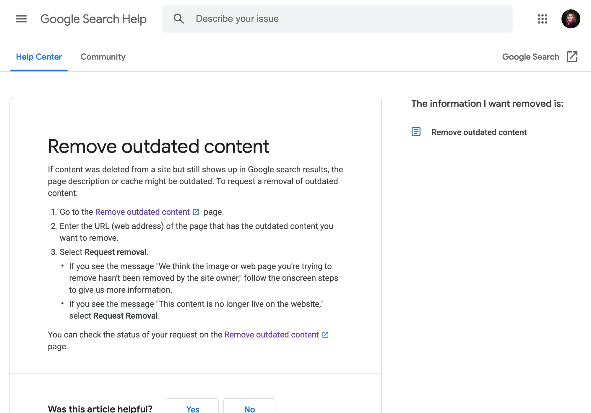

Yesterday I **_pretty much_** completed this site. There are still things to do,
add, etc. But that will happen over time as needed.

There was still one very important thing I hadn't addressed. In fact, in my
opinion, it's AS IMPORTANT as the code a site is created with. However, it
**_only_** relates to sites that have been propagated from one hosting service
to another AND share the same URL, **_or_** simply content that has been removed
from an existing site. In my case, the site contained the same URL at the old
hosting service and the new one, BUT the former was HTTP and now it is set to
HTTPS. This point **_too_** is important.

What am I talking about? **_Removing_** **outdated content** from **_Google
Search_**. For me this was especially important because I **_added_** **Google
Custom Search** to the site. This means that people **_search_** for **content**
using **Google Custom Search**, which uses **Google Search** to create **custom
searches** on sites. Whatever the **_visitor_** **searches** for on the site
will **_appear_** in the **Google Custom Search**, a **site's** **_customized
view_** of its **content** in **Google Search**. So if a **website owner** has
**_deleted_** a lot of **content** from the prior hosted version of their site
or deleted from their existing site, it will STILL appear in the **_current
site's_** **Google Custom Search**. **_That_** is just not very cool, right?

Perhaps those of you who are **devs** think is is a very **_rudimentary_** or
**_boring_** topic. However, **_no one_** **knows** this information **_by
default_**, and there are those who are **_not_** developers, who might want to
know! And besides, why would they want to pay someone to do something that
really is quite simple, when they could do it themselves and **_save their
resources_** for **_bigger_**, **_better_**, and **_more complicated_**,
**_code-related_** things they **_don't want to_** and **_can't_** **implement**
themselves.

There are steps you have to take in order to take advantage of **Google's**
**_outdated content_** **feature**.

**_First_**, and **_most important_**, you **_need_** to have a **gmail
account**. This **_gains you access_** to all **Google** products. Next, you
want to make sure that you are **recognized** as the **_owner_** of your **web
property** (site). I have had **web properties** via the **Google Search
Console** (formerly known as **WebMaster Tools**) since 2010, when **Google
WebMaster Tools** was released. I have also been using **Google Analytics**
forever, so **Google** **_recognizes_** me as the **_owner_** of the **sites** I
have added as properties that I own. You can also **_bypass_** **Google
Analytics** and
[add a web property](https://search.google.com/search-console/about) via the
**Google Search Console**. I personally like to use
[Google Analytics](https://analytics.google.com/analytics/web/) (now
programmatically improved upon by
[gtags](https://developers.google.com/analytics/devguides/collection/gtagjs/))
so I can know how much traffic I am getting on my site and where.

If you are already set up in some way with the
[Google Search Console](https://search.google.com/search-console/about), you can
immediately take advantage of the
[remove outdated content](https://support.google.com/websearch/answer/6349986?hl=en)
feature.

Happy **_outdated content removal_**!

## Related Resources:

-   [A Complete Guide to the Google Search Console](https://www.searchenginejournal.com/google-search-console-guide/209318/#close)

-   [Should you switch to Google Analytics’ Global Site Tag?](https://juliencoquet.com/en/2017/09/11/switch-google-analytics-global-site-tag/)
